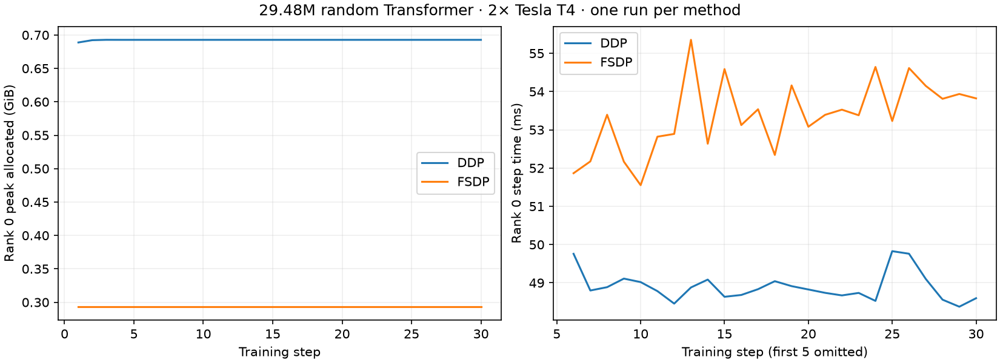

# Verified Kaggle dual-T4 DDP versus FSDP experiment

Source commit `b213d718e96aacf85c912e26d7da597b25aa1afa`. PyTorch 2.11.0+cu128, NCCL 2.28.9, two distinct Tesla T4 device UUIDs in exported reports. Eight-block randomly initialized causal Transformer, 29,479,936 full trainable parameters, synthetic tokens, batch 2 per rank, sequence 128, FP16 compute and AdamW. Both modes completed 30 steps on both ranks.

| Metric | DDP | FSDP FULL_SHARD |
|---|---:|---:|
| Resident parameter elements per rank | 29,479,936 | 14,739,968 |
| Peak PyTorch allocated per rank | 0.692788 GiB | 0.293356 GiB |
| Peak PyTorch reserved per rank | 0.765625 GiB | 0.494141 GiB |
| Median warm step, slower rank (steps 6–30) | 48.94 ms | 53.39 ms |

Measured peak allocator reduction **57.66%** in this workload. FSDP warm steps were about 9.1% longer in this single run. This illustrates a memory/communication trade-off, not a universal speed or memory claim. Methods ran sequentially, once each; initialization and first five steps are excluded only from the warm timing median. Memory peaks include every recorded step but exclude construction before per-step peak reset, CUDA context and some external allocations. No equal parameter dtype assumption is made: DDP uses FP32 parameters with autocast, FSDP uses FP16 parameter compute and FP32 reduction/optimizer states. Activation/workspace and implementation choices also affect memory, so the entire reduction cannot be attributed solely to parameter sharding.

Validation recomputed model parameter count, all four rank JSON files, steps 1–30, finite losses/times, unchanged gradient scales, allocator bounds, summary peaks, exactly halved FSDP parameters and distinct device identifiers. Same-rank DDP/FSDP losses differed by at most 0.000397. Rank output-agreement assertion passed inside the runner; raw validation tensors/checksums were not exported, so that assertion was not replayed locally.

This is real two-GPU full-parameter **29.48M synthetic Transformer** training. It does not demonstrate pretrained 7B/70B full fine-tuning, DeepSpeed, production scaling or useful language quality. Archive hash and recomputed metrics are in validation.json. No local GPU replay was possible.
